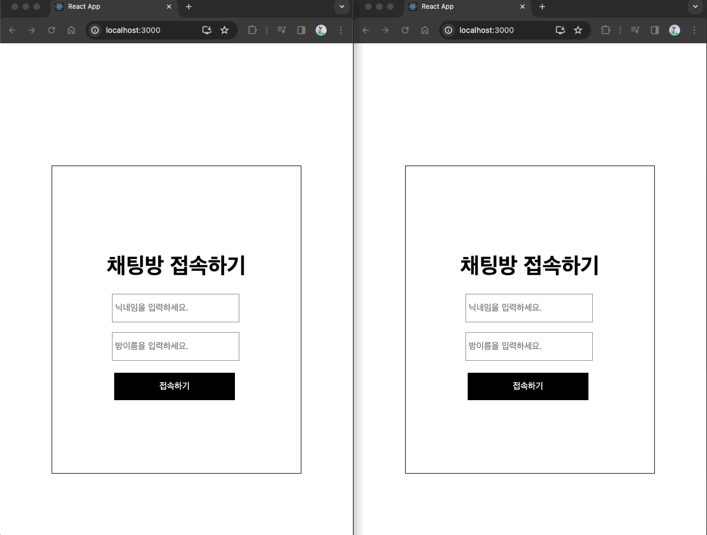

## Socket Chatting Web

### 이 프로젝트는 Socket.io와 React를 사용하여 클라이언트와 서버를 구현한 예제입니다.

### 사용자는 이름과 방이름을 작성한 뒤 입장한 채팅방에서 실시간 채팅을 할 수 있습니다.

## 기능

### 채팅방 기능: 사용자 및 다른 사용자는 이름을 입력 후, 동일한 채팅방 이름을 입력해 채팅방에 입장할 수 있습니다.

### 채팅 기능: 채팅방에서 실시간으로 채팅을 주고 받을 수 있습니다.

## 설치 방법

#### 프로젝트 클론 후 client 와 server 각 폴더에 npm install로 npm 설치

#### client와 server 각 폴더에서 npm start로 실행

## 사용 방법

#### 웹 브라우저에서 프로젝트를 열고, 이름을 작성 및 채팅방 이름을 작성해 해당 채팅방으로 입장합니다.

#### 입장한 채팅방에서 하단 인풋에 텍스트를 입력 후 전송합니다.

## 시연영상

